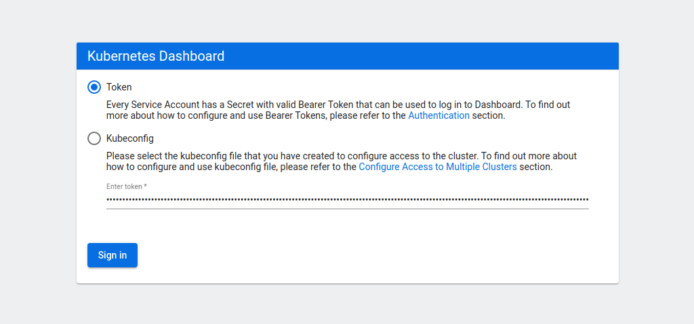

# Kubernetes Dashboard

## Background

The Kubernetes dashboard is a web-based UI for Kubernetes which provides an overview of the Kubernetes cluster as well as the individual resources running in it. Viewing, monitoring, and debugging operational aspects of the cluster is valuable in order to understand all the components and where the issues may exist during the debugging process.

## General Setup

1. [Install the Azure CLI](https://docs.microsoft.com/en-us/cli/azure/install-azure-cli)

2. If you do not already have one, [follow these steps to create an AKS Cluster](https://docs.microsoft.com/en-us/azure/aks/kubernetes-walkthrough)

3. Install the command-line tool, [kubectl](https://kubernetes.io/docs/tasks/tools/install-kubectl/), which will allow you to run commands against the Kubernetes cluster.

4. Connect to the cluster using the Azure CLI with the command:

    ```bash
    az aks get-credentials --resource-group myResourceGroupName --name myAKSClusterName
    ```

## Setting up the Kubernetes Dashboard

1. Install the Dashboard using Kubectl. The output of the command below will result in the creation of Kubernetes components needed for the dashboard.

   ```bash
   kubectl apply -f https://raw.githubusercontent.com/kubernetes/dashboard/v2.0.0/aio/deploy/recommended.yaml
   ```

2. Create a User - The dashboard supports various ways to manage access control. [We can create a simple admin user account](https://upcloud.com/community/tutorials/deploy-kubernetes-dashboard/#point-2) with privileges to modify. You can also [create a read-only user](https://upcloud.com/community/tutorials/deploy-kubernetes-dashboard/#point-3) if you would like to only view the different components of the cluster vs modifying it.

3. Access the Dashboard - After the installation of the dashboard and creation of the user accounts for it, we can create a proxy service on the localhost to access the dashboard.

    ```bash
    kubectl proxy
    ```

    Open a browser link to [this](http://localhost:8001/api/v1/namespaces/kubernetes-dashboard/services/https:kubernetes-dashboard:/proxy/) to see the dashboard login window.

4. Login to the Dashboard - this can be done with providing the location of the kubeconfig or generating a token which is unique to the dashboard currently running.

    

5. Use the dashboard to view the workloads, services, storage, config maps and logs for the pods on the Kubernetes cluster.


## References

1. [Detailed Tutorial](https://upcloud.com/community/tutorials/deploy-kubernetes-dashboard/)

2. [Examples of Usage](https://kubernetes.io/docs/tasks/access-application-cluster/web-ui-dashboard/)
